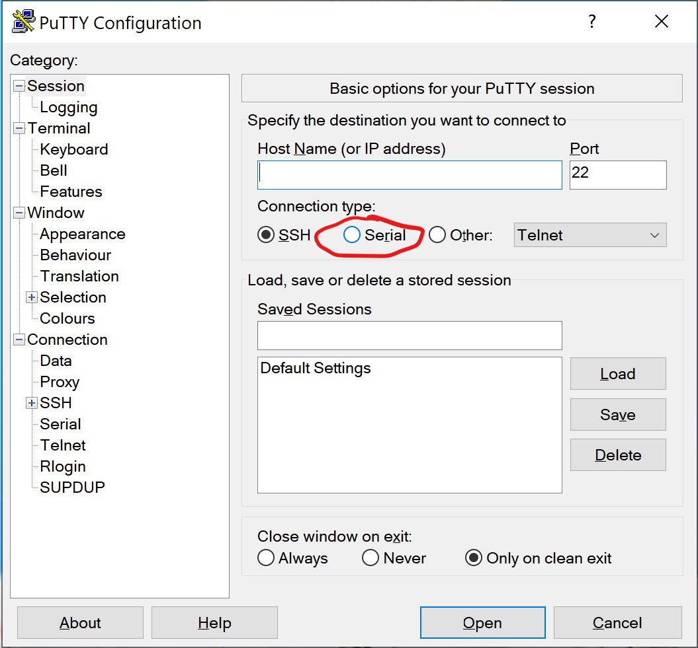
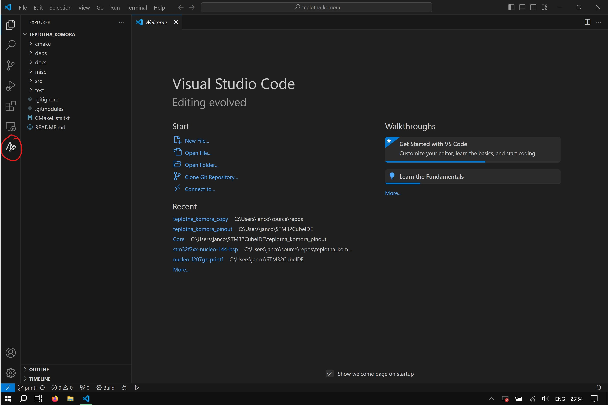
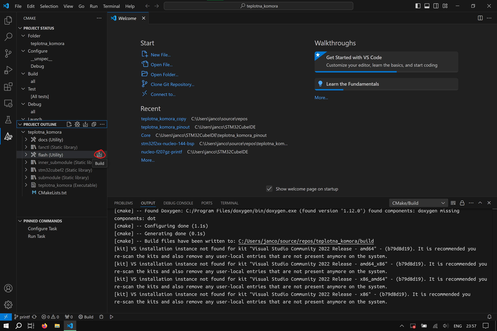

# Teplotná komora - Tímový projekt

Intro

## Quickstart

### Prerequisites

- **CMake** >= v3.22.0
- **Ninja** >= v1.11.0
- **gcc-arm-none-eabi** >= v12.3.0
- **Doxygen** >= 1.12.0 (optional for docs generation)
- **PuTTY, Minicom** or similar program to read serial COM port
- **STM32CubeProg** >= v2.17.0 used for flashing FW
- **STM32CubeIDE** (optional Eclipse based IDE used for programming and debugging STM32 projects)
- **STM32CubeMX** (optional auto project generator)

#### Installation Windows

You can use the `winget` pkg manager to get the previously mentioned prerequisites via command:
```
winget install Kitware.CMake Ninja-build.Ninja Arm.GnuArmEmbeddedToolchain DimitriVanHeesch.Doxygen PuTTY.PuTTY
```

Make sure to reload the PowerShell session after installation, or add any additional missing installation directories to your `$env:PATH`. Alternatively, run the PowerShell script under `misc\env.ps1`, which temporarily adds `gcc-arm-none-eabi` and `STM32CubeProg` (installed in default locations) to your `$env:PATH`.

#### Installation Ubuntu

```
# apt install cmake ninja gcc-arm-none-eabi doxygen minicom
```

#### STM32Cube Installation

If you plan on using `STM32CubeIDE` `STM32CubeProg` and  `gcc-arm-none-eabi` comes bundled with it.

Note: A [myST](https://my.st.com) account is required to download any STM32Cube Development Tools from the ST website.

You can get them under following links:
- [STM32CubeIDE](https://www.st.com/en/development-tools/stm32cubeide.html#st-get-software)
- [STM32CubeMX](https://www.st.com/en/development-tools/stm32cubemx.html#st-get-software)
- [STM32CubeProg](https://www.st.com/en/development-tools/stm32cubeprog.html#st-get-software)

### Usage

#### Configure

Configure the project by issuing following command:
```
cmake -S . -B build -G Ninja
```

#### Compile

Compile the project by issuing following command:
```
cmake --build build -j [num of CPU threads]
```

#### Flash

To flash the firmware first connect the STLink via USB to your PC and issue command:
```
cmake --build build --target flash
```

#### Read COM Windows

In order to list all available COM ports issue the following command:
```
Get-WmiObject Win32_SerialPort | Select-Object DeviceID, Caption, Description
```
or execute the PowerShell script under `misc\list_com.ps1`. Look for device with caption `Silicon Labs CP210x USB to UART Bridge (COM6)`. Launch `PuTTY` and select the `Serial` radio button for `Connection type`, enter `COM6` for `Serial line` and `115200` for `Speed`.




#### Read COM Ubuntu

List available serial ports:
```
$ ls /dev/ttyACM*
```

Launch minicom and listen to `/dev/ttyACM0`:
```
$ minicom -D /dev/ttyACM0
```

#### Build docs

```
cmake --build build --target docs
```

### Using VSCode

Recommended extensions:

- **C/C++**
- **C/C++ Extension Pack**
- **C/C++ Themes**
- **CMake**
- **CMake Tools**

Install them by issuing following commands:
```
code --install-extension ms-vscode.cpptools
code --install-extension ms-vscode.cpptools-extension-pack
code --install-extension ms-vscode.cpptools-themes
code --install-extension twxs.cmake
code --install-extension ms-vscode.cmake-tools
```

Enable these extensions and restart VSCode.

#### Configure




#### Compile


#### Flash



## Rules

### General guidelines

#### Structure

- This project uses C++20 with an option to upgrade to C++23 if necessary.
- Use `.cpp` suffix for source files and `.hpp` for header files.
- Use `#pragma once` for header guards instead of a pair of `#ifndef FOO_H \n #define FOO_H` at the top and `#endif` at the bottom of a header file.
- Create your individual CMake subdirectories in `src/` see example in `src/fanctl`.
- Document function and object declarations in header files see example in `src/app.hpp` for doxygen docs generation.
- Guard your created CMake subdirectories source and header files within `namespace` keyword with the same name as the name of the created subdirectory.
- Keep the same structure of the subdirectories as in example subdirectories.
- Place public header files into `src/[name_of_subdirectory]/include/[name_of_subdirectory]/`.
- Keep private header files in `src/[name_of_subdirectory]` just like in `src/submodule`.
- Create test functions inside `src/[name_of_subdirectory]/include/[name_of_subdirectory]/test.hpp` ready to test your newly created functionality.
- Modularize your code as much as possible into individual subdirectories.
- Avoid creating circular dependencies within your subdirectories.

#### Procedural programming

- Avoid global non-`const` variables.
- Use simple control flow.
- Avoid deeply nested code.
- Avoid functions that are too long. Consider refactoring and splitting them into multiple functions.
- Use `const` keyword by default as much as possible in place of variables, object member declarations, function arguments and object member method declarations.
- Pass arguments as `const` reference to avoid unnecessary copying.
- Use `unsigned` version of numerical data types to avoid overflow into negative values when needed.
- Use `constexpr` whenever computation of an expression is possible at compile time.
- If you want to return mulitple parameters from a function return a `struct` or use `std::tuple`.
- Use C++ for range loops to iterate over iterable objects or use iterators.
- Use `#include <cstdint>` and `uint8_t` or `uint16_t` data types for example to explicitly express the size of a variable instead of `unsigned char` or `unsigned short`.
- Avoid using `static` keyword for local variables.

#### Object-oriented programming

- If you need more abstraction you're allowed to use OOP.
- Use `class` keyword for objects containing member methods, use `struct` keyword for objects with member variables only. If you want to add methods to it rewrite it with `class` keyword.
- Use of dynamic or preferably static polymorphism is allowed.
- RTTI is enabled for now don't rely on it too much, it may be disabled in the future in order to save FLASH space.

#### Functional programming

- Lambda expressions allowed.
- Only `const` lambda expression variables allowed.
- Don't use whole scope auto capture inside the lambda, use only variables you need inside lamba expression capture list.
- Lambda expression `mutable` specifier allowed.
- Be careful when using lambda captures in multi-threaded applications, can lead to segfaults pass as a parameter to the lambda instead or come up with a different solution.

#### Style

- Use `nullptr` keyword instead of `NULL` macro.
- Avoid using preprocessor macros. Use `if constexpr` code blocks for conditional code generation.
- Following line:
```
    const std::array<uint8_t, 4> data = { 0, 1, 2, 3 };
```
copy initializes the array, meaning it invokes the default aggregate initialization constructor `std::array<T, U>::array(0, 1, 2, 3)` and then invokes the default copy constructor `std::array<T, U> std::array<T, U>::array(const std::array<T, U>& rhs)`. Use the following line to avoid unecessary copying:
```
    const std::array<uint8_t, 4> data { 0, 1, 2, 3 };
```
- Don't use unecessary `void` keyword in places of function declarations with no arguments like this:
```
    void func(void);
```
Instead use:
```
    void func();
```

### Banned language features

- `goto` keyword
- Function pointers use, C++ lambda expressions instead, unless some C API requires using them.
- C-style raw pointers, use C++ references instead, unless some C API requires using them.
- Comma-separated initialization for example:
```
    int32_t x = 0, y = 1;
```
- Empty uninitialized non-`const` variable definitions.
- C++ exceptions
- Operator overloading
- `using namespace` in global scope (allowed for local scope).
- Heap allocations (meaning avoid using `std::string`, `std::vector`, `new` and `delete` keyword, `calloc`, `malloc` and `free` functions etc.) instead allocate on the stack and use RAII to release memory resources.
- C-style raw square bracket arrays, use `std::array` instead. When interfacing with C APIs using pointers use `T* std::array<T, U>::data()` to extract the raw pointer from the `std::array` `class` for example.
- C-style raw `const char*` strings use `std::string_view` instead.
- C-style `union` objects, use `std::variant` instead.
- Anonymous C-style enumerations using the `enum` keyword, please use `enum class` instead.
- C-style type casting, use C++ `reinterpret_cast<T>` or much more preferably `static_cast<T>` equivalent when type conversion is needed.
- `const_cast<T>` change the type specifier for the variable to be non-`const` instead
- `typedef` keyword for creating user defined type name aliases instead use C++ `using` keyword equivalent
- `typedef` keyword in place of user defined type declarations

### Formatting

- Use 4 space tabwidth delimiter.
- Use snake_case for names for `namespace`s, local and global non-`const` variables and object member variables and functions:
```
namespace example_namespace_name {
    int32_t example_variable;
    void example_function();
    class MyClass {
        int32_t example_member;
    };
}
```
- Use UpperCamelCase for names of user defined types created with `struct` or `class`, and for enumartions with `enum class`:
```
    struct MyStruct {};
    class MyClass {};
    enum class MyEnumClass {
        Red,
        Blue
    };
```
- Use UPPER_SNAKE_CASE for global `const` variables:
```
    const int32_t MY_VARIABLE { 12345 };
```
- Keep opening curly braces on the same line when creating a newly nested block of code. Make sure to close the nested block of a code with a closing curly braces, or brackets etc. on a new line like this:
```
    for(size_t i = 0; i < 10; i++) {
        if(i == 0) {
            // do something 
        }
        // do something else
    }
```
- Use single line comments, avoid using multiline comments when possible.
- Use explicit designated initialization for user defined types like this:
```
struct MyStruct {
    int32_t x;
    int32_t y;
};

const MyStruct my_struct_instance {
    .x = 1,  // Designated initializer for 'x'
    .y = 2   // Designated initializer for 'y'
};
```
- Separate lines of code that are too long, for example function calls with too many arguments into something like this:
```
    const std::array<int32_t, 4> array { 1, 2, 3, 4 };
    std::for_each(
        array.begin(),
        array.end(),
        [index = 0](const int32_t i) mutable {
            std::cout << index++ << ": " << i << std::endl;
        }
    );
```