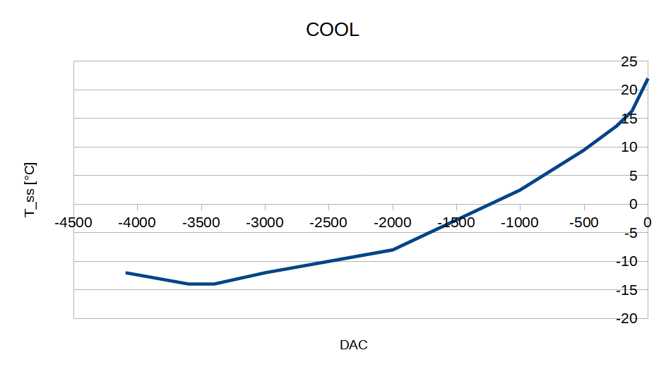

# HEAT

| DAC  | T_SS |
| ---- | ---- |
| 2600 | 85   |
| 1300 | 52   |
| 0    | 22   |

# COOL

| DAC   | T_SS |
| ---- | ---- |
| 0     | 22   |
| -125  | 16.3 |
| -250  | 13.6 |
| -500  | 9.5  |
| -750  | 6    |
| -1000 | 2.5  |
| -2000 | -8   |
| -3000 | -12  |
| -3400 | -14  |
| -3500 | -14  |
| -3600 | -14  |
| -4095 | -12  |